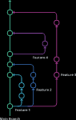

# Git Flow

Resources [here](https://www.gitkraken.com/learn/git/best-practices/git-branch-strategy)

### What is a git branch strategy ? 
The main idea behind the Git flow branching strategy is to isolate your work into different types of branches.

There are five different branch types in total:

- Main
- Develop
- Feature
- Release
- Hotfix

The two primary branches in Git flow are main and develop. There are three types of supporting branches with different intended purposes: feature, release, and hotfix.

___
## Github flow
Git Flow in the way recommended by GitHub

