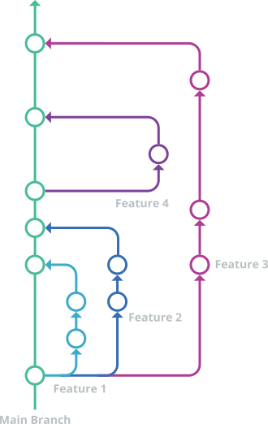

# Git Flow

Resources [here](https://www.gitkraken.com/learn/git/best-practices/git-branch-strategy)

### What is a git branch strategy ? 
The main idea behind the Git flow branching strategy is to isolate your work into different types of branches.

There are five different branch types in total:

- Main
- Develop
- Feature
- Release
- Hotfix

The two primary branches in Git flow are main and develop. There are three types of supporting branches with different intended purposes: feature, release, and hotfix.

___
## Github flow
Git Flow in the way recommended by GitHub

GitHub Flow Considerations
While working with the GitHub flow branching strategy, there are six principles you should adhere to to ensure you maintain good code.

- Any code in the main branch should be deployable.
- Create new descriptively-named branches off the main branch for new work, such as feature/add-new-payment-types.
- Commit new work to your local branches and regularly push work to the remote.
- To request feedback or help, or when you think your work is ready to merge into the main branch, open a pull request.
- After your work or feature has been reviewed and approved, it can be merged into the main branch.
- Once your work has been merged into the main branch, it should be deployed immediately.

