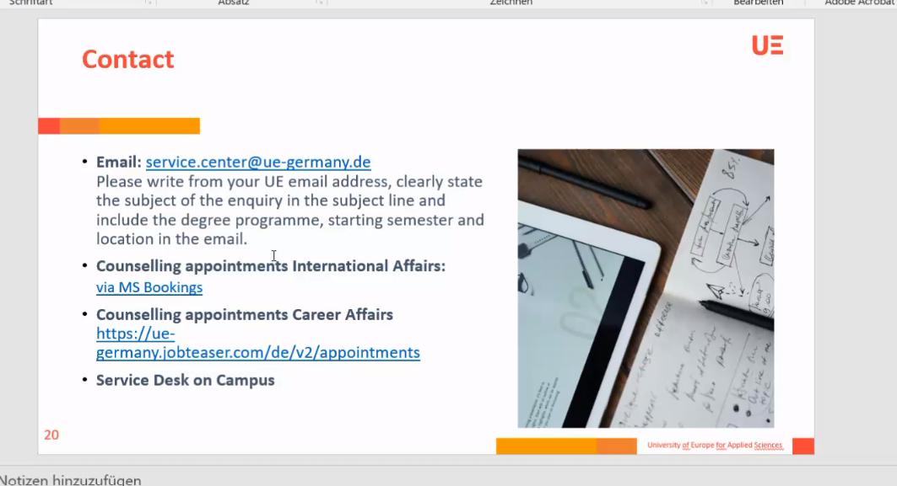

# InternshipNotes
#internship

[[InternshipCompanies]]

- You can do it anywhere in the world as long as its recognized 
- being paid does not count as recognized automatically.

  - 16 weeks 
  - 600 working hours 
  - with only one employer
  - WS2022/2023 must be done in the lecture free period
    - They dont sound very flexible with the time requirements
  
1 sep (or even august first) to feb 28th but must be finished before lectures start again

        Can be with a company, charitable thing, or anything of the sort 
Must check with a supervisor to check if place to be is valid
Need the company to fill relevant forms at the end of the internship

****

## The report
Must write a report at least 10 pages containing all of what we did
Must do a colloqium in which I have to present the content of my internship

****
## Timeline
- By jan 5th, must decide between iternship and study abroad (no choice in my case I think)
- in my 4th semester, will have to fill the first page of the official paper 
- Stay in touch with the career center in 4th semester
- Important to find a supervisor (prob Berger) **Form will be uploaded on Job Teaser**
- Send back the form by October 1st (internship time)
- Participation in colloqium is mandatory.
****
- Frapper large, ne pas se concentrer sur une seule boite
- Personaliser application
- Documentation trouvable sur Job Center
****
Will receive big email in december
**November 21 will be internship info session about internships abroad**
- UE Career tutorial english (is name of the Teams for internship info sessions)

 

[//begin]: # "Autogenerated link references for markdown compatibility"
[InternshipCompanies]: InternshipCompanies.md "InternshipCompanies"
[//end]: # "Autogenerated link references"