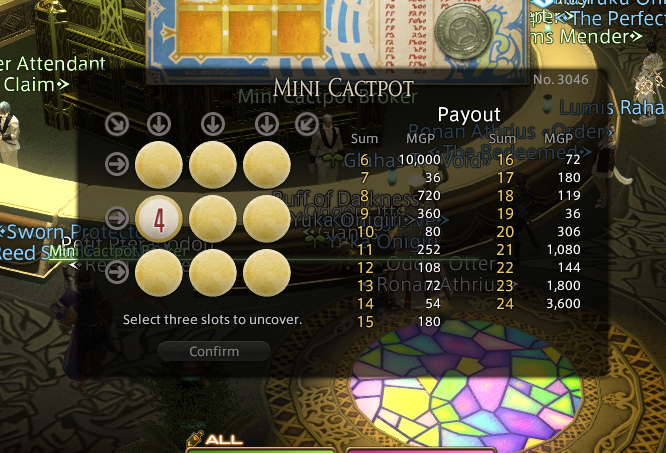

# Mini-Cacpot strategy

### The game

In mini-cacpot, you get a 3x3 grid of cells, with one number filled at random. Every grid is randomly generated every time you make an attempt, up to 3 per day.
You can reveal 3 cells of your choice, and after that you have to select a line of 3 cells (horizontal, vertical or diagonal), and the amount of the
cells will get you a prize, according to the chart below.

| Sum | MGP                     |
| --- | ----------------------- |
| 6   | $\color{yellow}{10000}$ |
| 7   | 36                      |
| 8   | 720                     |
| 9   | 360                     |
| 10  | 80                      |
| 11  | 252                     |
| 12  | 108                     |
| 13  | 72                      |
| 14  | 54                      |
| 15  | 180                     |
| 16  | 72                      |
| 17  | 180                     |
| 18  | 119                     |
| 19  | 36                      |
| 20  | 306                     |
| 21  | 1080                    |
| 22  | 144                     |
| 23  | 1800                    |
| 24  | $\color{orange}{3600}$  |

---

### How do I win ?

In case that wasn't obvious, you want to hit 6 as much as possible, and when not, fall back to 24 instead, or 23 in the worst case scenario.

The idea is simple : use the number always given to you, and make a Y shape within the grid.

    

So, if you get a grid like this :

| **.** | **.** | **.** |
| ----- | ----- | ----- |
| **.** | **x** | **.** |
| **.** | **.** | **.** |

    

You would complete it this way :

| **x** | **.** | **x** |
| ----- | ----- | ----- |
| **.** | **x** | **.** |
| **.** | **x** | **.** |

    

If your prompt looks like this :

| **.** | **.** | **.** |
| ----- | ----- | ----- |
| **.** | **.** | **x** |
| **.** | **.** | **.** |

    

Then just complete that way.

| **x** | **.** | **.** |
| ----- | ----- | ----- |
| **.** | **x** | **x** |
| **x** | **.** | **.** |

The orientation does not matter, what does is that you have a Y shape in the end.

## But why ?

Because that shape is the one that will give you the most visibility on the board give that your goal is to find a line containing a specific sequence of number. Once the Y is completed, you will always have at least one number for every possible line. In another words, you want to make impossible to make a choice where you would know no number in the sequence.

| **x** | **.** | **$\color{red}{.}$** |
| ----- | ----- | -------------------- |
| **x** | **x** | **$\color{red}{.}$** |
| **x** | **.** | **$\color{red}{.}$** |

_Yucky, there's one line that's completely obscure to you_

---

## Final note

This is not a game you can win every time. This article barely gives you a way to make your attempts more reliable. You may not win the first time. However, applying that technique, I usually get a jackpot at least once every 5 days, and more often once every 2 or 3 days. It's become fairly frequent to get two jackpots in a row. Before applying that, I was not able to get a jackpot even after weeks of daily attempts.

Happy playing ! [Let me know](s.decuyper314@gmail.com) if this helped you !

