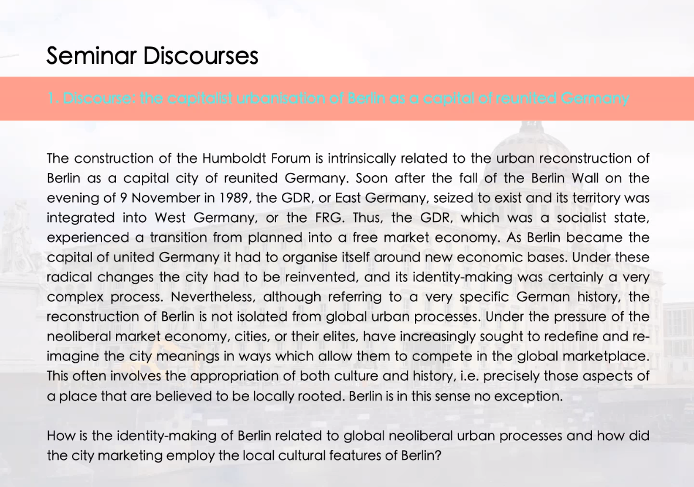

from dec 13th until the end, the presentations
https://www.no-humboldt21.de

seminar paper should me around 25k characters (around 10 pages)

need to find an angle and write about it

the dissonance between message sent by public institutions, what they want to commmermorate, and what they actually do

- what message does it send when culture and memory are accessible only to the wealthy
- What are the price ranges and how does that affect the audience
- WHAT is the actual demographic targeted by the humnoldt forum
- how to they advertise ? how do they market themselves ?
- pointing at the hypocrisy (rising rents in berlin vs. cafe a 7 euros a la sortie de l'exposition)

  museums in the UK are for free

homework :
create a 250 - 300 words text of what my seminar paper will be about
summuraising what the paper will be about

- research question (can be multiple research questions)
  "what do i want to find more about / what do I want to find out / why am i writing this" (should explain this)
- introducing the topic and explain the basics (in the intro), what is the research question, method
- doing an interview could be interesting
- doing by examples (in my case : what and how does the humboldt forum sells culture)
- google "handbook of {topic im interested in}"
- check what has been written before about the topic, what would my contribution be

  **There's a example in the Files probably**
