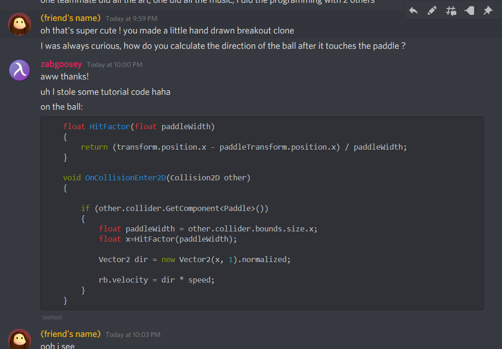

# Breakout clone bouncing ball



detail 
```csharp
float HitFactor(float paddleWidth)
    {
        return (transform.position.x - paddleTransform.position.x) / paddleWidth;
    }

    void OnCollisionEnter2D(Collision2D other)
    {
        
        if (other.collider.GetComponent<Paddle>())
        {
            float paddleWidth = other.collider.bounds.size.x;
            float x=HitFactor(paddleWidth);
    
            Vector2 dir = new Vector2(x, 1).normalized;
    
            rb.velocity = dir * speed;
        }
    }
```

#math #breakout code to calculate direction of the ball in a breakout clone