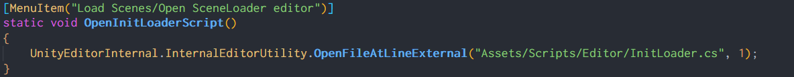
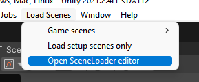

# UnityTips

If there is a file you open frequently, you can make more easily accessible by opening it from the **File** menu using the ```[MenuItem]``` attribute, using ```OpenFileAtLineExternal()```. You can even specify the line you want !
***

***



Mario style death animation with rigidbodies
